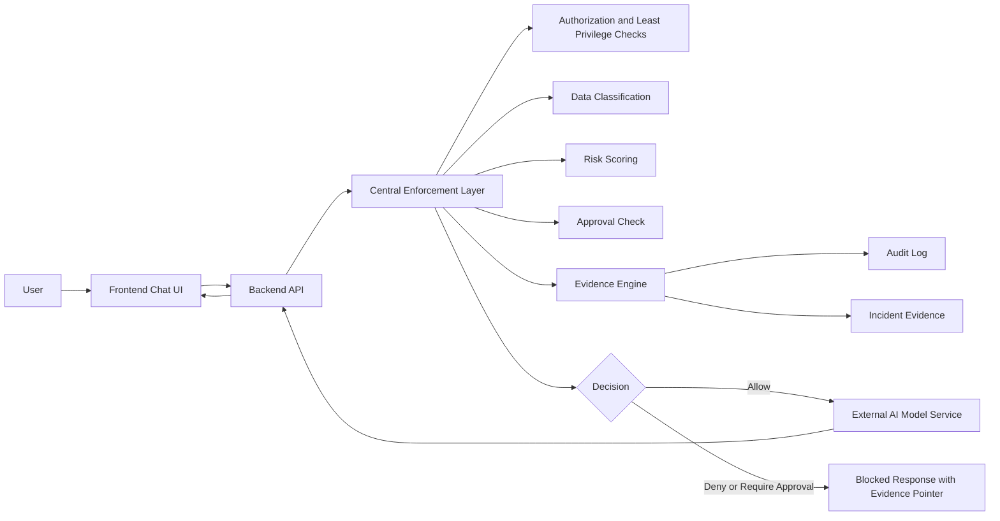

# GRC Engineering Security Enforcer

## 1. Executive Summary

This project is an Agentic AI security mentor web application with a backend enforcement layer for SOC 2-aligned security controls. The application provides an AI-assisted security mentoring workflow while enforcing authorization, least privilege, data classification, audit-style evidence generation, structured security logging, risk scoring, encryption validation, and incident evidence creation before sensitive model actions execute.

The security value is that model-facing actions are no longer treated as ordinary API calls. Sensitive requests pass through a centralized enforcement layer that can allow, deny, or require approval based on actor context, tenant boundary, requested action, data classification, environment, approval state, and evidence generation status.

This report is public-safe portfolio evidence. It explains the architecture, controls, validation results, risk reduction, and business value without publishing proprietary source code, secrets, private logs, or sensitive implementation details.

## 2. Problem Statement

Agentic AI systems often fail audits and security reviews because model calls, tool execution, prompt handling, and data output happen without consistent authorization, classification, logging, or evidence. Common gaps include direct model execution, missing least privilege checks, no audit trail for allow/deny decisions, weak data handling controls, and no proof that security controls were enforced at runtime.

This project addresses that problem by adding a server-side enforcement layer around sensitive AI execution paths. The goal is not to claim certification, but to demonstrate how SOC 2-style controls can be embedded into application behavior and validated through tests.

## 3. Project Objectives

- Protect sensitive AI execution paths before requests reach the external model service.
- Require actor identity, role, scope, tenant, environment, and approval context for protected actions.
- Block restricted data from entering prompts, text-to-speech requests, logs, or model calls.
- Generate audit-style evidence for allowed, denied, and approval-required decisions.
- Validate that evidence and logging failures fail closed.
- Map implemented controls to SOC 2-style Trust Services Criteria areas.
- Produce a public GitHub-ready evidence package without exposing source code or secrets.

## 4. High-Level Architecture

The application has a React frontend, an Express backend API, and an external AI model integration. The backend contains the key security enforcement layer. Protected routes call the policy and evidence engine before the model client is initialized or invoked.

Security enforcement points:

- Backend API routes for chat and text-to-speech requests.
- Centralized policy engine for allow, deny, and approval-required decisions.
- Data classification before model execution.
- Evidence engine before and during security decisions.
- Incident evidence creation for high-risk or denied events.
- Production TLS validation before protected execution.

## 5. Key Features Implemented

- AI chat workflow for security mentoring and scenario analysis.
- Text-to-speech workflow for model responses.
- Centralized SOC 2-aligned enforcement module.
- Actor, role, scope, tenant, and environment validation.
- Least privilege checks for protected API actions.
- Data classification with restricted-data blocking.
- Runtime risk scoring for protected model operations.
- Approval requirement for high-risk production actions.
- Structured evidence records with control IDs, policy IDs, trace IDs, log IDs, timestamps, and integrity markers.
- Security log and incident record generation.
- Fail-closed behavior when evidence or logging cannot be generated.
- Automated tests for positive and negative security scenarios.

## 6. Security Controls Implemented

Access control and least privilege:

- Risk reduced: unauthorized model use, excessive permissions, and confused-deputy style execution.
- Enforcement point: backend enforcement layer before protected API execution.
- Evidence: tests validate authorized execution, missing actor denial, and missing scope denial.
- Status: implemented and validated for protected chat and text-to-speech routes.

Data classification:

- Risk reduced: secrets or restricted data entering prompts, model calls, logs, or audio generation.
- Enforcement point: request classification before external model invocation.
- Evidence: tests validate restricted-data blocking.
- Status: implemented and validated for protected request payloads.

Audit-style evidence generation:

- Risk reduced: inability to reconstruct security decisions or prove control enforcement.
- Enforcement point: evidence engine during every protected decision.
- Evidence: tests validate evidence creation and fail-closed behavior when evidence generation fails.
- Status: implemented and validated in automated tests.

Risk scoring and approval:

- Risk reduced: high-risk production AI actions executing without review.
- Enforcement point: policy decision logic considers environment, actor type, resource, and classification.
- Evidence: tests validate high-risk production requests require approval and approved high-risk requests execute with evidence.
- Status: implemented and validated for current protected routes.

Encryption validation:

- Risk reduced: protected production requests over non-TLS transport.
- Enforcement point: backend request validation.
- Evidence: tests validate production non-TLS requests are blocked.
- Status: implemented and validated at API request level.

Incident evidence:

- Risk reduced: high-risk or denied control events being invisible after the fact.
- Enforcement point: evidence store creates incident-style records for high-risk or denied events.
- Evidence: tests validate incident creation for approved high-risk actions.
- Status: implemented and validated for enforcement events.

Secure error handling:

- Risk reduced: leaking internal errors or sensitive implementation details to users.
- Enforcement point: backend route error responses.
- Evidence: route behavior returns bounded public errors while logging server-side.
- Status: implemented; deeper log redaction testing is recommended.

## 7. SOC 2 / GRC Control Mapping

This project is SOC 2-aligned and supports SOC 2 readiness evidence collection. It is a technical demonstration of control enforcement and is not a substitute for an independent audit, formal attestation, or a full organizational control environment.

| SOC 2-Style Area | Implemented Project Control | Evidence |
| --- | --- | --- |
| CC2.1 / CC2.2 | Policy decisions are represented as executable control logic and included in evidence metadata. | Control matrix and security tests. |
| CC3.2 | Runtime risk scoring evaluates environment, actor type, resource, and data classification. | Risk scoring test cases. |
| CC6.1 / CC6.2 / CC6.3 / CC6.6 | Protected actions require actor context, role, scope, tenant, and least privilege. | Authorization and negative security tests. |
| CC6.5 | Restricted data is classified and blocked from protected AI execution paths. | Restricted-data blocking test. |
| CC7.2 / CC7.3 | Security decisions generate structured evidence and logs. | Evidence-generation tests and evidence design. |
| CC7.4 / CC7.5 | High-risk and denied decisions create incident-style evidence. | Incident evidence validation test. |
| CC8.1 / CC8.2 | Production transport validation and control metadata support change/security governance. | TLS validation test and control mapping. |

## 8. Evidence Collected

Public-safe evidence created for this portfolio package:

- `docs/evidence/control-evidence-matrix.md`
- `docs/evidence/before-after-risk-reduction.md`
- `docs/evidence/test-results-summary.md`
- `docs/evidence/evidence-index.md`
- `docs/evidence/redaction-notes.md`
- `docs/evidence/private-evidence-checklist.md`
- `docs/readme-section.md`
- `docs/evidence/screenshots/screenshot-checklist.md`

Validated command evidence:

- TypeScript check passed with `npm.cmd run lint`.
- Security test suite passed with `npm.cmd test`: 8 tests, 8 passed.
- Production build passed with `npm.cmd run build` after approved sandbox escalation because the local sandbox initially blocked Vite/esbuild parent-directory reads.

## 9. Screenshots

One public-safe evidence screenshot was added:

### Test and Control Evidence Summary

What it shows:

- Security validation summary.
- Implemented control categories.
- Evidence artifacts created.
- Source-code-safety and redaction statement.

Why it matters:

- Proves the project has public-safe visual evidence without exposing source code, secrets, private URLs, raw logs, or local paths.
- Summarizes the verified security test results and implemented control areas.

Live browser capture was attempted with local Edge headless, but this environment did not produce a browser screenshot file. A manual capture checklist is still provided:

- [Screenshot Checklist](./evidence/screenshots/screenshot-checklist.md)

Additional screenshots to add manually before publishing:

- Dashboard or chat workflow overview with no private prompts.
- Blocked action response showing the public-safe compliance decision.
- Test run summary showing 8 passing security tests.
- Evidence folder view showing sanitized report artifacts.

Each screenshot should be reviewed against the redaction notes before publication.

## 10. Testing and Validation

Commands run:

| Command | Result | Purpose |
| --- | --- | --- |
| `npm.cmd run lint` | Passed | TypeScript validation. |
| `npm.cmd test` | Passed: 8 tests, 8 passed | Security enforcement validation. |
| `npm.cmd run build` | Passed after approved sandbox escalation | Production build verification. |

Security behavior validated:

- Authorized low-risk development chat creates evidence.
- Production requests missing actor identity are denied.
- Missing scopes are denied.
- High-risk production model use requires approval.
- Approved high-risk production model use is allowed with evidence.
- Restricted data is blocked before model execution.
- Evidence/logging failure fails closed.
- Production non-TLS requests are blocked.

Limitations:

- Tests focus on the backend enforcement engine and protected API behavior.
- No end-to-end browser test was captured during this report generation.
- Runtime audit logs were not published because raw logs may contain sensitive operational data.

## 11. Before-and-After Risk Reduction

| Area | Before | After | Evidence | Status |
| --- | --- | --- | --- | --- |
| Protected model execution | Model routes could execute without centralized actor, scope, tenant, and evidence checks. | Protected routes call centralized enforcement before external model invocation. | Tests for allow, deny, and approval-required decisions. | Implemented and validated |
| Least privilege | No route-level proof that the actor had the required action scope. | Required scopes are checked for protected actions. | Missing-scope test. | Implemented and validated |
| Data classification | User text could reach model execution without classification gating. | Restricted data is classified and blocked before execution. | Restricted-data blocking test. | Implemented and validated |
| Evidence generation | Security decisions were not audit-ready by default. | Evidence records include actor, action, resource, decision, controls, policies, timestamps, and integrity marker. | Evidence-generation and fail-closed tests. | Implemented and validated |
| High-risk production actions | Production AI actions had no explicit approval gate. | High-risk production actions require approval metadata. | Approval-required and approved-action tests. | Implemented and validated |
| Transport security | Production request transport was not validated in protected flow. | Non-TLS production requests are denied. | TLS denial test. | Implemented and validated |
| Incident visibility | Denied or high-risk actions had no incident-style evidence. | High-risk and denied decisions create incident evidence. | Incident evidence test coverage. | Implemented and validated |

## 12. Business Value

This project demonstrates how a security team can move from policy statements to runtime enforcement. Instead of relying only on written procedures, the backend requires authorization, classification, evidence, and risk decisions before sensitive AI actions execute.

Business and security value:

- Reduces the risk of unauthorized AI model use.
- Improves audit readiness by generating structured evidence for security decisions.
- Helps GRC teams map control objectives to concrete technical enforcement.
- Gives AppSec and AI security reviewers a repeatable pattern for guarding model-facing routes.
- Reduces manual review effort by producing evidence at runtime.
- Improves visibility into denied, high-risk, and approval-required actions.
- Demonstrates practical secure engineering across AI, backend APIs, policy-as-code, and evidence design.

## 13. Skills Demonstrated

- Secure software design.
- Agentic AI security.
- SOC 2-aligned control implementation.
- GRC automation.
- Evidence generation.
- Authorization and least privilege design.
- Policy-as-code.
- Secure logging and audit trail design.
- Runtime risk scoring.
- Data classification.
- Encryption/TLS validation.
- Incident evidence design.
- Negative security testing.
- TypeScript backend development.
- Technical documentation for security stakeholders.
- Public-safe redaction and portfolio evidence preparation.

## 14. Redaction and Source Code Safety

This public report intentionally excludes:

- Source code listings.
- Secrets, API keys, tokens, credentials, cookies, and private keys.
- Raw audit logs.
- Private URLs and private app links.
- Internal hostnames, cloud account IDs, tenant IDs, and environment-specific identifiers.
- Customer, employee, or user records.
- Full configuration files.
- Sensitive exploit payloads.

Only high-level architecture, module names, control descriptions, sanitized command summaries, and validation outcomes are included.

## 15. Limitations

- The project demonstrates SOC 2-aligned technical controls but does not prove SOC 2 compliance or certification.
- Access review automation is not fully implemented as a scheduled workflow.
- Change management gates for prompt/model/tool configuration are partially represented by policy and evidence design, but not yet integrated into a CI/CD approval workflow.
- Screenshot evidence was not captured automatically in this environment.
- The current tests validate the enforcement engine; broader end-to-end and browser tests would strengthen the evidence package.
- Long-term immutable storage, SIEM integration, and signed evidence records are future improvements.

## 16. Future Improvements

Short-term:

- Add end-to-end API tests for route responses.
- Capture sanitized UI and test-result screenshots.
- Add stricter redaction unit tests for security logs.
- Add documentation for required production actor headers and approval metadata.

Medium-term:

- Add scheduled access review workflow for humans, agents, API keys, and service accounts.
- Add CI/CD change-control gate for prompt, model, tool, policy, and deployment changes.
- Add evidence export by control ID and date range.
- Add dashboard filtering for evidence, incidents, and control mappings.

Advanced:

- Add signed evidence records or append-only storage.
- Integrate with SIEM or ticketing workflows.
- Add anomaly detection for repeated denied actions and unusual actor behavior.
- Add multi-tenant evidence separation.
- Add automated SOC 2-style evidence bundle generation.

## 17. Final Outcome

The project now demonstrates a practical SOC 2-aligned enforcement pattern for an Agentic AI web application. Sensitive model-facing actions are checked before execution, evidence is generated for security decisions, restricted data is blocked, high-risk production actions require approval, and key behaviors are validated by automated tests. The result is a public-safe portfolio artifact that shows applied AI security, GRC automation, and secure backend engineering without exposing private source code or sensitive data.
